# Readme

## 목차

1. 서비스 소개
2. 기능 소개
3. 기술 스택
4. 프로젝트 일정
5. 개발 멤버 및 회고

---

### :star2: 서비스 소개

- 서비스명 : Gotcha
- 서비스 내용 : 영화 추천과 함께 영화 배우 카드를 이용한 게임을 한번에..!
- 개발 기간 : 2022.11.16 ~ 2022.11.25

### :feet: 기능 소개

1. 로그인, 회원가입

   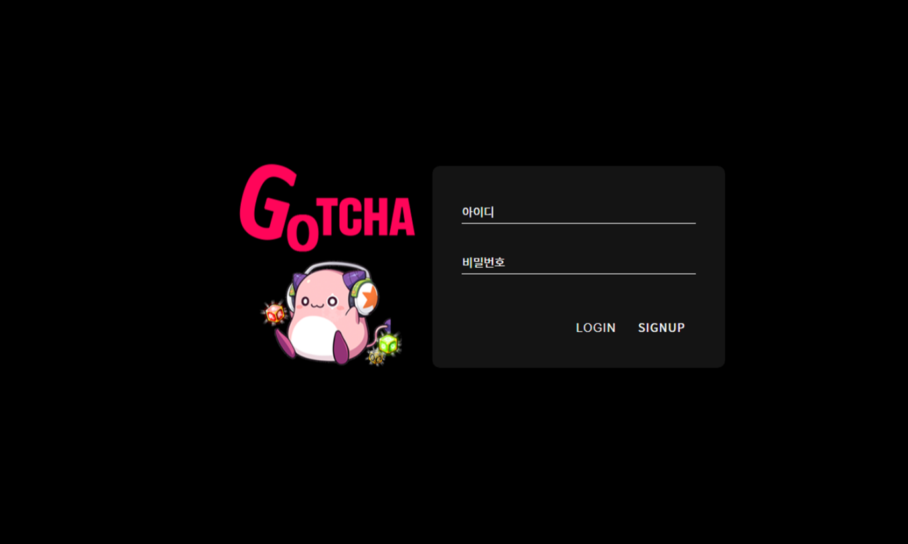

   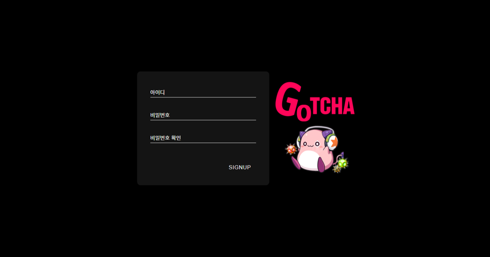

   ​

2. 선호 장르 입력

   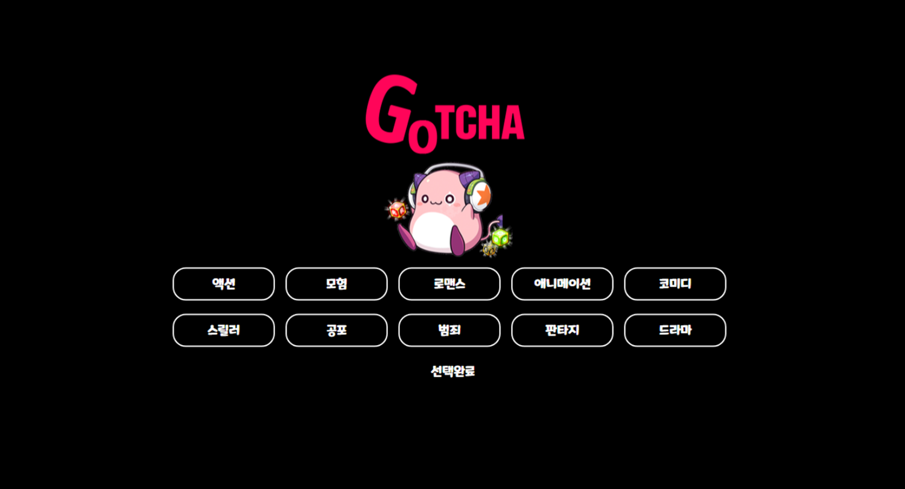

   - 선호 장르는 최대 3개까지 선택이 가능하고 선택된 선호 장르들은 추후 영화 메인 페이지의 영화 추천에 사용됨

3. 영화 메인 페이지

   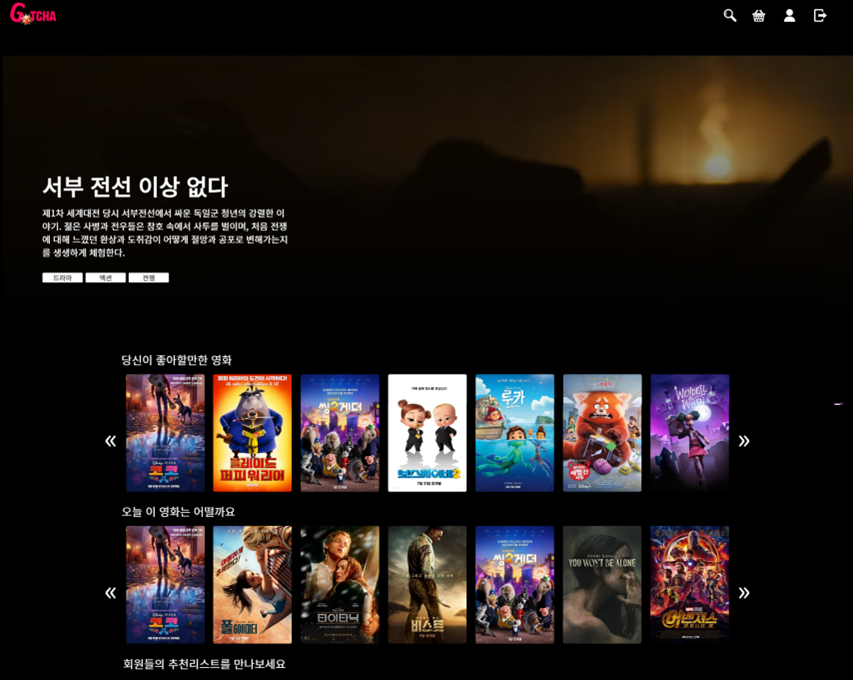

   - 유저의 선호 장르를 바탕으로한 영화들과 랜덤으로 추천된 영화들이 나타남
   - 다른 유저들이 생성한 영화 플레이리스트도 볼 수 있음

4. 영화 상세 페이지, 플레이리스트 상세 페이지

   - 플레이리스트 상세 페이지

     - 해당 플레이리스트 내부에 어떤 영화들이 담겨있는지 보여줌
     - X 를 눌러 플레이리스트에서 영화를 뺄 수 있으며 영화 이미지를 누르면 해당 영화의 상세 페이지로 이동함

     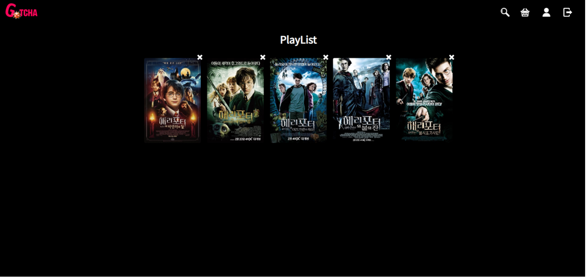

   - 영화 상세 페이지

     - 영화의 제목, 줄거리, 비슷한 장르의 영화, 예고편
     - 영화에 좋아요를 누를 수 있고 내가 가진 플레이리스트에 영화를 넣을 수도 있음
     - 리뷰 기능

     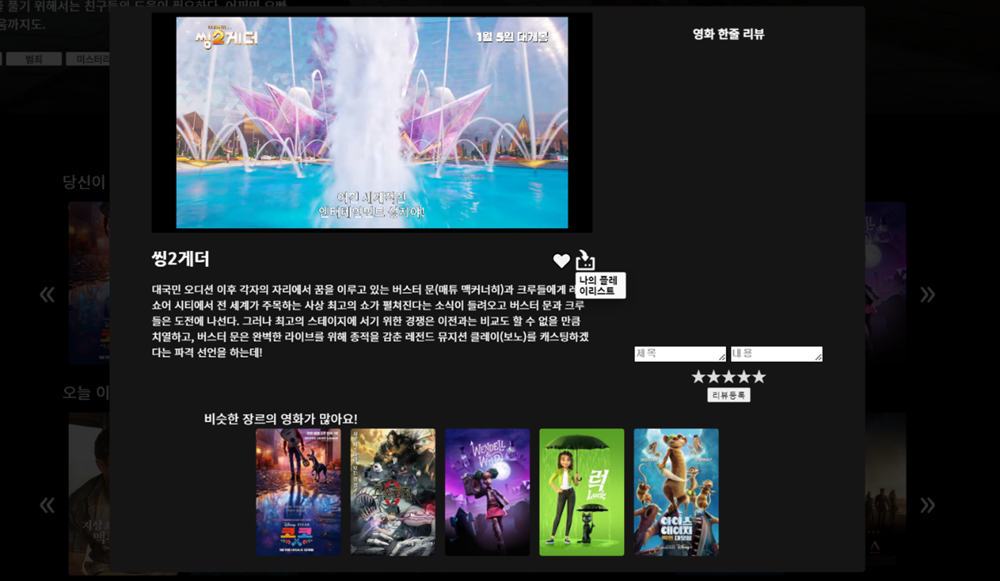

5. 영화 검색 페이지

   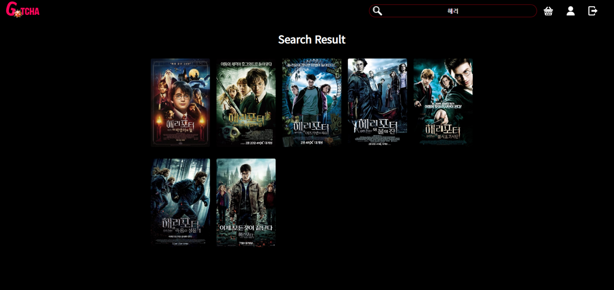

   - 제목에 검색어가 포함된 모든 영화를 보여줌

6. 영화 마이페이지

   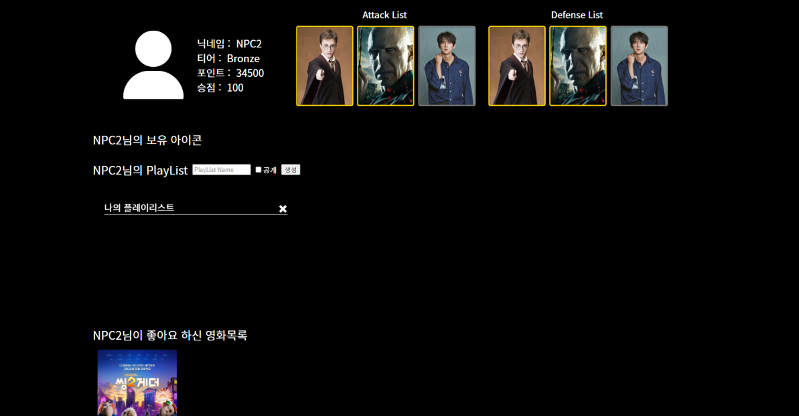

   - 나의 기본 정보와 보유한 아이콘, 추후 카드 게임에서 쓰일 덱 구성 현황과 나의 플레이리스트들, 좋아요 한 영화들을 확인할 수 있음

7. 영화 샵 페이지

   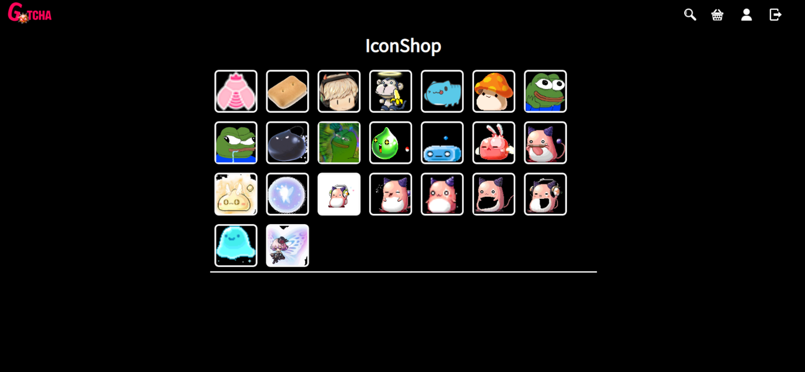

   - 프로필 이미지에 사용할 수 있는 아이콘을 살 수 있음(구매하는데 필요한 포인트는 회원가입 시 일정량 지급되며 추후 게임을 통해 얻을 수 있음)

8. 게임쪽 메인 페이지

   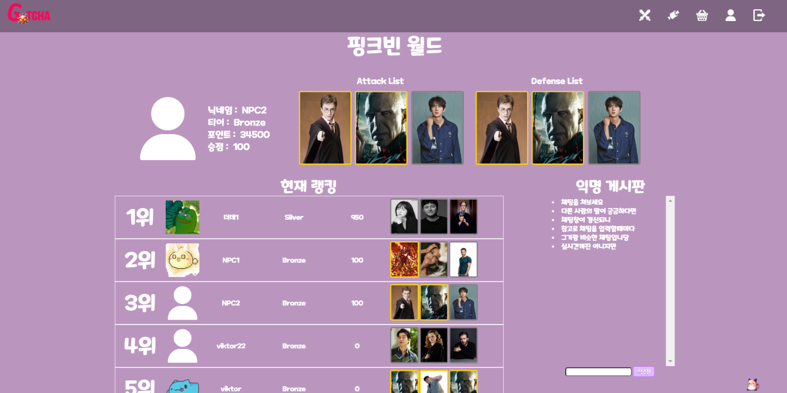

   - 나의 게임 관련 간단한 정보, 카드 게임 랭킹, 익명 게시판
   - 익명 게시판은 3초마다 갱신되며 글을 입력할때도 갱신됨

9. 게임 쪽 마이페이지, 덱 구성 페이지, 카드 상세 페이지

   - 게임 쪽 마이페이지

     - 카드 게임 대전 기록과 보유하고 있는 카드들을 볼 수 있음
     - 카드 이미지를 선택하면 카드 상세 페이지로 이동

     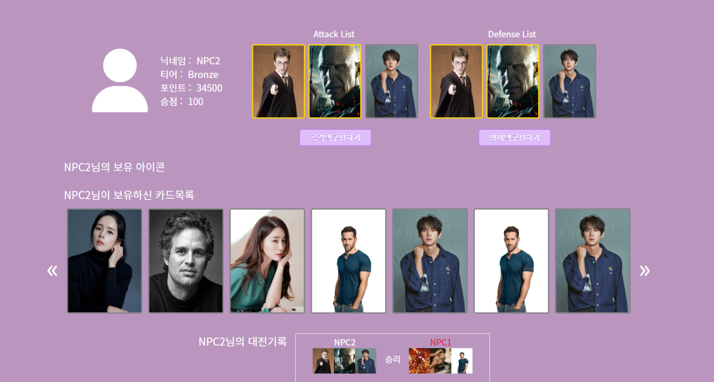

   - 덱 구성 페이지

     - 카드 게임에 사용할 공격덱과 방어덱 구성할 수 있음
     - 카드 한개를 중복으로 등록할 수 없으며 반드시 3장을 넣어야 함

     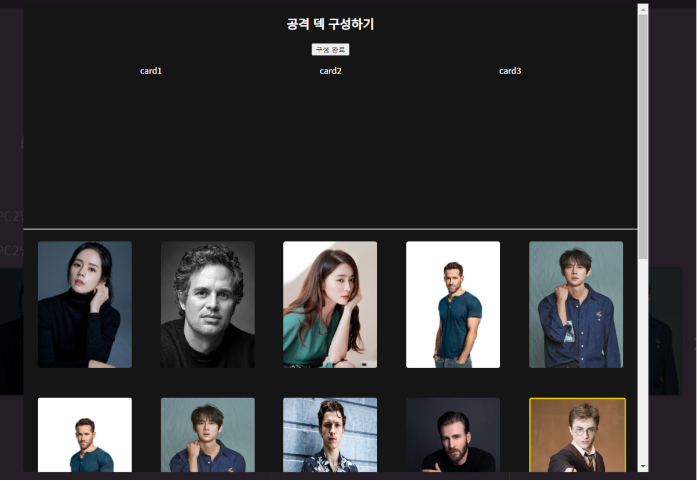

   - 카드 상세 페이지

     - 카드 별로 공격력, 방어율, 체력이 다름
     - 샵에서 구매 가능한 큐브로 잠재능력을 재설정

     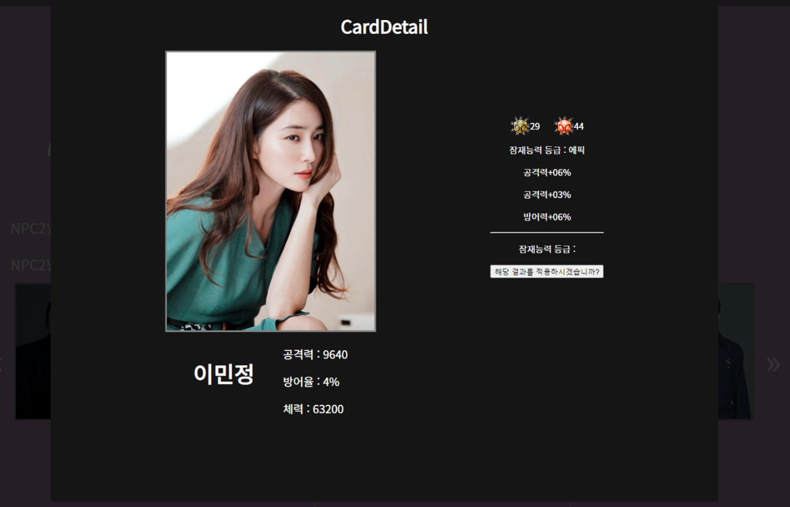

10. 게임 샵 페이지

  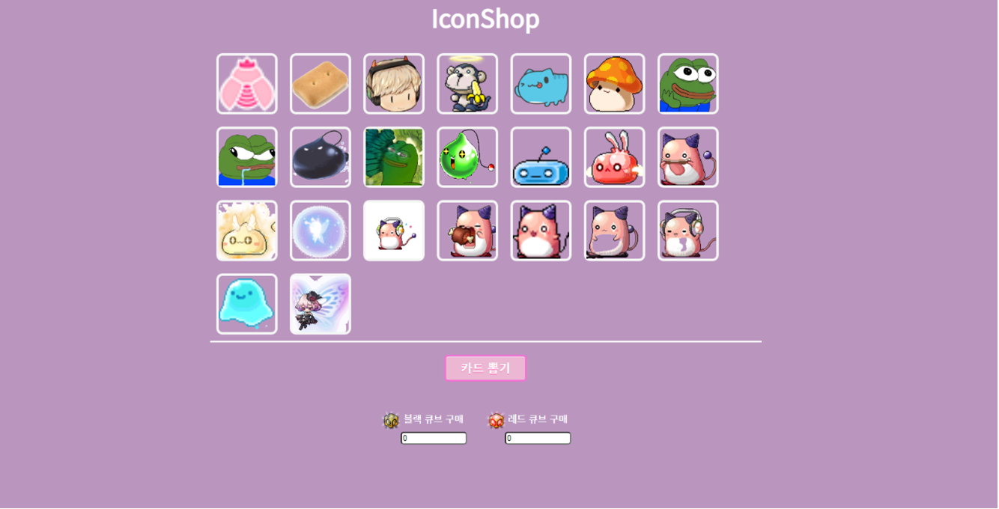

  - 아이콘과 큐브를 구매할 수 있으며 배우 카드를 뽑을 수 있음
  - 배우 카드는 대부분 일반 카드이며 낮은 확률로 좀 더 좋은 스탯을 가진 골드 카드를 획득할 수 있음

11. 게임 관련 페이지

    - 카드 게임 페이지

      - 나의 공격 덱과 랜덤한 상대의 방어 덱이 결투하는 페이지
      - 3판 2선승제

      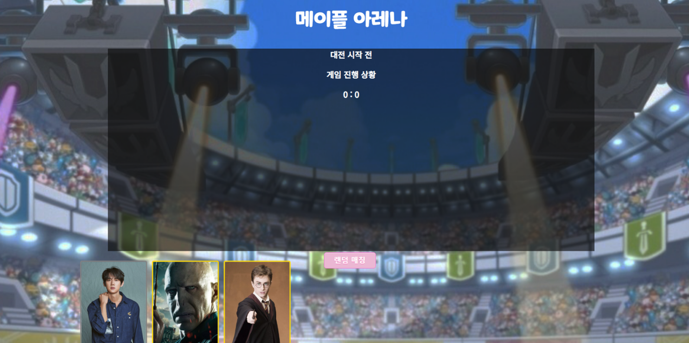

    - 고기 먹은 핑크빈 페이지

      - 시작 버튼을 누르면 가운데 핑크빈이 고기를 먹고 핑크빈들이 랜덤하게 섞임
      - 그 중 처음 고기를 먹은 핑크빈을 찾는 게임
      - 찾으면 포인트를 획득할 수 있음

      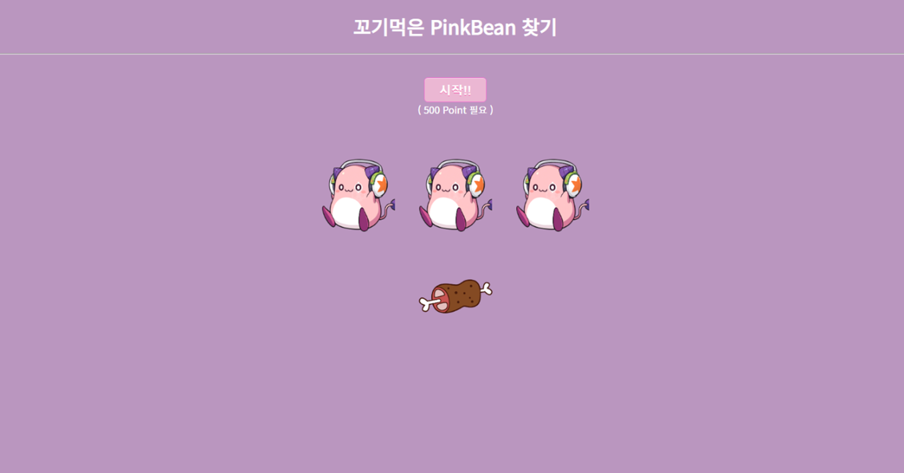

---

### :pen: 기술 스택

- Backend
  - Django
- Frontend
  - Vue 2
- CI/CD
  - AWS EC2

---

### :paperclip:산출물

1. ERD

   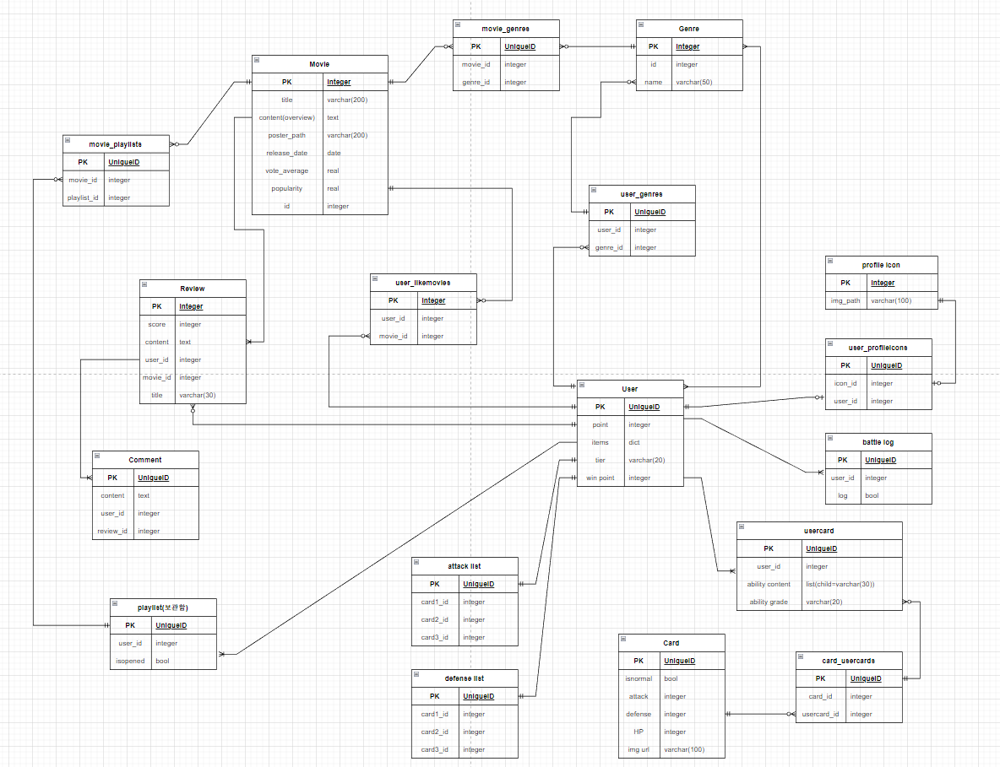

2. component 구조

   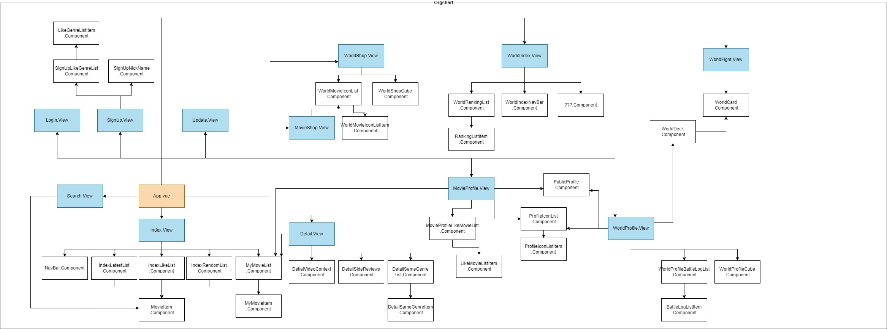

---

### :black_heart: 개발 멤버 및 회고

- 유혜빈

  - 맡은 역할

    - Backend 전체, Frontend 게임 관련 파트 기능들, EC2 배포

  - 회고

    - 아쉬웠던 점

      - 처음 프로젝트를 진행하다보니 git을 어떻게 해야 좀 더 효율적으로 사용할 수 있을지 고민하지 못하고 conflict가 날까봐 전전긍긍하기만 했던 것 같다. 다음부터는 그러한 협업 툴을 좀 더 잘 사용할 수 있게 노력해야 겠다. 또한 기획 단계에서 주어진 시간을 고려하지 못했다. 기획을 크게 해버려서 시간 내에 모든 것을 하기 위해 나와 팀원 둘이서 너무나 힘든 시간을 보냈었다. 앞으로는 욕심을 내는 것도 좋지만 주어진 자원 내에서 할 수 있는 계획을 짜고 싶다.

    - 프로젝트를 진행하며 배운 점

      - 의사소통의 중요성

        - 기획단계에서 나의 의견을 간단히 설명하고 이해했겠지 라는 안일한 마음으로 넘어간 것들이 많았는데 막상 코드를 짤 때 서로 이해한 것이 달라 다시 의논 단계로 돌아가면서 시간을 많이 잡아먹었었다. 같은 말이라도 사람마다 이해하는 것이 다를 수 있기 때문에 기획 단계에서 좀 더 꼼꼼하게 모든 것을 짚고 넘어가야한 다는 것을 배웠다.

          ​

- 한상현

  - 맡은 역할
    - Frontend 전반, 화면 디자인 및 레이아웃, 영화 관련 파트 기능들
  - 회고
    - 아쉬웠던 점
      - 코드를 짜고 다양한 케이스로 시험해보지 못해 마지막날 발표날에 버그를 알게되어 고치지못한 부분이 있다. 영화 댓글다는거에 유저들 프로필사진이 그 유저의 프로필이 아닌 내 프로필사진들로 채워지는 버그였는데 내아이디로만 로그인해서 체크해보고 다른 아이디로는 체크해보지 못해서 버그를 알아차리지 못했었다. 시간이 부족하지 않게 하는게 최우선이지만 코드 체크를 할땐 꼼꼼히 체크하는게 중요하다는 걸 느꼈다.
      - 쌩 CSS로만 레이아웃을 짜니 아무래도 시간도 오래걸리고 나중엔 클래스 명이 중복되고 충돌도 나서 원하는대로 잘 이루어지지 않았다. 게다가 반응형은 하나도 구현하지 못하여서 다른 화면에 대해서는 깨지고 내가 원했던대로 나타나지 않아서 너무 아쉬웠다. 다음 프로젝트때는 조금 더 CSS를 간편하게 쓸 수 있는 라이브러리나 프레임워크를 사용해보아야겠다.
    - 프로젝트를 진행하며 배운 점
      - 시간의 배분, 처음 시작의 중요성
        - 나중에가니 시간이 너무 부족해서 허덕였다. 처음에 프론트엔드라 나중에 백엔드 부분 마무리 되면 본격적으로 시작해야지 하는 마음이 큰 문제였던 것 같다. 백엔드 팀원을 기다릴게 아니라 백엔드 없이도 할수 있는 부분, 컴포넌트 기본구조코드, 기본적인 CSS디자인 등 할 것들이 많은데 너무 여유를 가졌던게 나중에 결국 시간부족으로 돌아와 프로젝트의 질을 낮출 수 밖에 없었다. 다음 프로젝트 부터는 좀 더 처음부터 함께 시작해서 효율적으로 프로젝트를 진행해야겠다.
      - 코드 설명의 필요
        - 내가 짠 코드들에 대한 주석이 정말 중요하다는 걸 느꼈다. 코드를 짤땐 당연히 이건 무슨 기능을 위한거지~ 하면서 주석하나 없이 쭉쭉 그냥 짜면서 진행했는데 나중에 그 코드를 기능을 추가하거나 수정해야 할 일이 있을때 기능을 찾는것 부터가 쉽지않고 막상 찾더라도 내가 짠 코드를 내가 이해하기가 어려운일이 발생하고 이해하기위해서 많은 시간을 들여야 했다. 다음 프로젝트부터는 기능별, 코드별 필요할만한 곳에 최소한의 주석을 꼭 다는 습관을 들여야겠다.